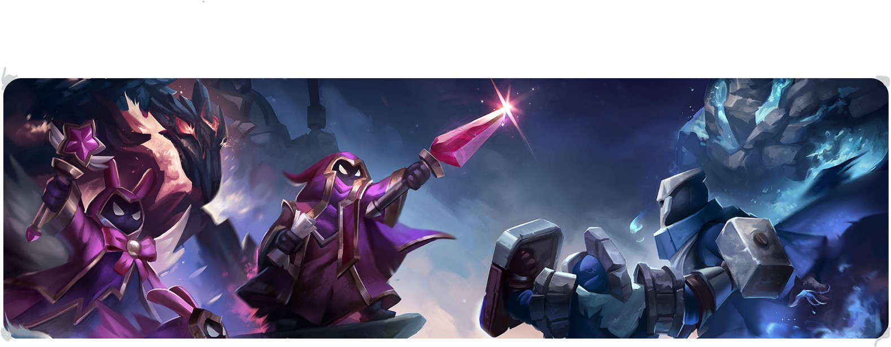

<!DOCTYPE html>
<html lang="en">
<head>
<link rel="stylesheet" type="text/css" href="main.css">
<link rel="stylesheet" type="text/css" href="bootstrap.min.css">
<link rel="stylesheet" type="text/css" href="bootstrap.css">

<meta charset="UTF-8">
<meta name="viewport" content="width=device-width, initial-scale=1.0">
      <title>Epic Gamers Clan</title>
      
      <link href="https://cdn.jsdelivr.net/npm/bootstrap@5.1.0/dist/css/bootstrap.min.css" rel="stylesheet">
    </head>
    <body>
    
      
      <nav class="navbar navbar-expand-lg navbar-dark bg-dark">
        

          <a class="navbar-brand" href="#">Epic Gamers Clan</a>
          <button class="navbar-toggler" type="button" data-bs-toggle="collapse" data-bs-target="#navbarNav" aria-controls="navbarNav" aria-expanded="false" aria-label="Toggle navigation">
            
          </button>
          

            <ul class="navbar-nav ms-auto">
              <li class="nav-item">
                <a class="nav-link" href="index.html">Home</a>
              </li>
              <li class="nav-item">
                <a class="nav-link" href="#">Clan Rules</a>
              </li>
              <li class="nav-item">
                <a class="nav-link" href="#">Contact</a>
              </li>
            </ul>
          

        

      </nav>
    
     
      <section class="hero-section">
        

          <h1>Welcome to Epic Gamers Clan!</h1>
          
Your ultimate squad for competitive gaming!

        

      </section>
      

        
      

      
     
      <section class="container my-5">
        

          

            

              
              

                <h5 class="card-title">About Us</h5>
                
Epic Gamers Clan is a group of competitive gamers who love to win and have fun. Join us for exciting challenges!

                <a href="#About us" class="btn btn-primary">Learn More</a>
              

            

          

    
          

            

              
              

                <h5 class="card-title">Upcoming Tournaments</h5>
                
Our next tournament is just around the corner. Get ready to compete for the top spot!

                <a href="#tournaments" class="btn btn-primary">View Tournaments</a>
              

            

          

    
          

            

              
              

                <h5 class="card-title">Achievements</h5>
                
Check out the impressive achievements and victories of our clan members!

                <a href="#" class="btn btn-primary">See Achievements</a>
              

            

          

        

      </section>
    
      
      <section id="tournaments" class="bg-light py-5">
        

          <h2>Join the Next Tournament</h2>
          
Sign up now and be part of our next big event!

          <a href="#" class="btn btn-primary btn-lg">Register Now</a>
        

      </section>
    
      
      <footer>
        

          
&copy; 2025 Epic Gamers Clan. All rights reserved.

          

           FaceBook | Twitter | Instagram
          

          

           Privacy Policy | Terms of Service
          

        

      </footer>
    

      
    </body>
    </html>
    

</body>
</html>
